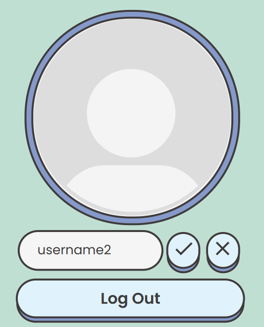

# PINUS STUDY USER GUIDE
**PINUS STUDY** is a study forum for **NUS Indonesian students**.

## Features

### Changing username

Changes the username of the user.

Before change             |  Changing
:-------------------------:|:-------------------------:
  |  

* Users can change their username in the profile page
* Click the pencil icon to change your username
* New username must be a valid username. Otherwise, error message will appear.
* Click :heavy_check_mark: to change and :x: to cancel